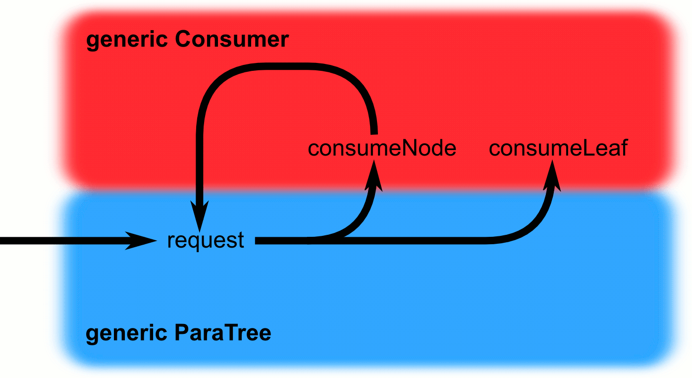
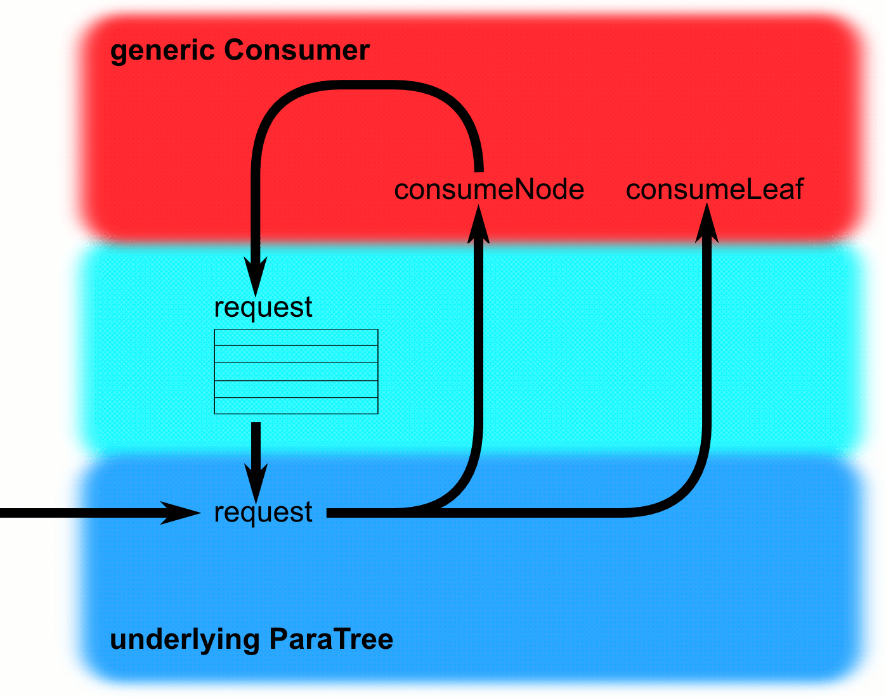
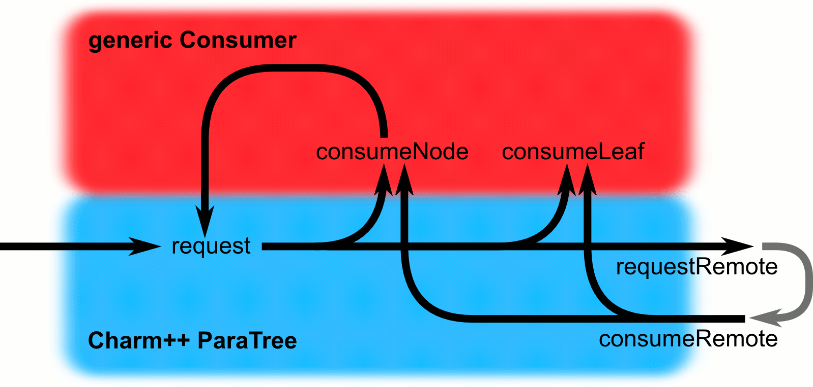

# ParaTreeT dev

This is the Parallel Tree Toolkit (ParaTreeT) development repo, 
which includes experimental and unfinished code.

## Library Overview

There are currently only two key abstractions in the ParaTreeT library:

- A ParaTree provides access to tree data upon request.
    - A pointer-based ParaTree could store pointers to children in each tree node.
    - An array ParaTree could store all the tree nodes in a binary heap array.
    - A distributed-memory ParaTree could access tree data via the network, and 
      maintain a local cache.

- A Consumer performs a computation using the tree data.
    - A Barnes-Hut consumer could walk the tree to compute gravity at one location.
    - A smoothed-particle hydrodynamics consumer could walk the tree to find its k nearest neighboring particles.
    - A raytracer consumer could walk the tree to find a ray-object intersection.

In general, the ParaTree's requestKey<Consumer> method 
delivers tree node and leaf data to a Consumer by calling the 
Consumer's consumeNode and consumeLeaf methods.
If it needs more data, the Consumer can then (recursively) 
call the tree requestKey again to fetch more data.

<p>

</p>

This cycle can happen on either CPU, GPU, or a mix of the two.

On the GPU, recursion is somewhat expensive; but it is simple to
write a ParaTree which stores the requested keys in a stack 
(for depth-first traversal) or a queue (for breadth-first traversal), 
rather than using recursion.  Neither the Consumer
nor the underlying ParaTree need to be changed for this to work.

<p>

</p>

On a distributed-memory parallel machine, some tree data will not
be available locally.  The ParaTree can request this remote data on behalf 
of the Consumer, and deliver it to the Consumer as it arrives.  Because the 
tree controls the order data is delivered to the Consumer, we can 
continue to consume local data while network requests are in progress,
consume remote data as soon as it arrives, and 
free the consumer from the need to count outstanding network requests.

<p>

</p>

## Call signatures and contracts

```ParaTree::requestKey<Consumer>(const Key &key,Consumer &c)```

The ParaTree MUST eventually deliver the tree node or leaf data 
associated with this key to this consumer.

The key MUST identify a valid tree node or leaf.


```Consumer::consumeNode(const NodeData &data,const Key &key)```

```Consumer::consumeLeaf(const LeafData &data,const Key &key)```

The Consumer accepts this node or leaf data, and updates its 
internal computation.

The Consumer MAY make more tree requests in either call.

The Consumer MUST NOT assume their requests will be satisfied in
any particular order--trees are allowed to reorder requests.


Proposed call:
```ParaTree::requestChildren<Consumer>(const Key &key,Consumer &c)```

If the key identifies an internal node of the tree, this is 
equivalent to calling requestKey on each of the children of this node.
If the key identifies a leaf, this is equivalent to calling
requestKey(key).


## Benefits

The use of templates means all the library code can be folded away 
and inlined by the compiler, for the highest possible performance.
The library makes no assumptions about the type of tree, keys,
node or leaf data, or parent classes of any of the types.

The exact same Consumer code can run on the graphics hardware with CUDA,
on a multicore CPU with OpenMP, or on a distributed-memory cluster
with Charm++.  We can swap out trees, add or remove caching or reordering layers, 
and the Consumers are not changed.


## Challenges

For Consumers to work with arbitrary tree types (quad, oct, Kd, inside-outside, etc), we need an abstraction for the Consumer to request "all the children" of a given node.  For Barnes-Hut or raytracing, it would be sufficient to add a tree method "requestChildren" with the same signature as requestKey (is this enough, or can we imagine Consumers that want to look at a few children, then give up on the whole node?).

Consumers typically mutate while performing a computation.  A better consumer interface might expose this consumer state, which would allow us to migrate a consumer from GPU to CPU during a computation, or combine partial results from parallel consumers.  For example, Barnes-Hut consumers only accumulate (add) a vector acceleration.  k-nearest consumers keep a heap of k neighbors.  


